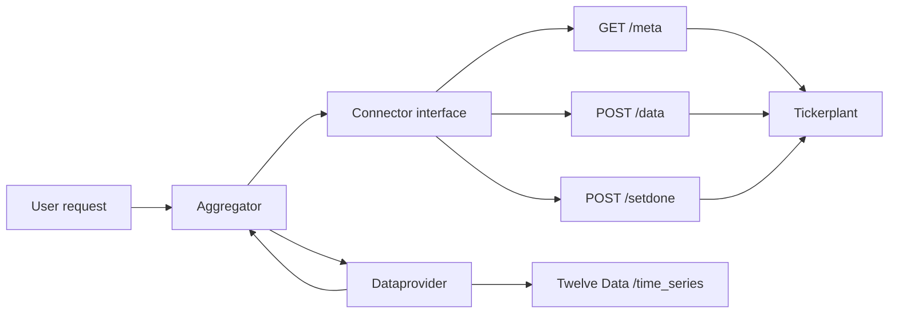

# Dataprovider Architecture

## Purpose

`dataprovider` retrieves requested minute-level OHLCV data and supplies it to the tickerplant. The external market-data source is Twelve Data. The tickerplant is the local source of truth for cached data and metadata coverage.

## Components



### `src/dataprovider/aggregator.py`

`Aggregator` is the request queue and worker:

- validates `(symbol, start_date, end_date)` requests;
- splits a long request into intervals below the Twelve Data limit;
- queues intervals and processes them in configurable batches;
- invokes the configured callback with successful provider payloads;
- requeues failed intervals for a later worker attempt.

The singleton design allows callers to submit work without creating a worker for every request.

### `src/dataprovider/dataprovider.py`

`Dataprovider` owns the Twelve Data integration:

- decodes the base64 API key from configuration;
- builds `time_series` requests with symbol, interval, and date bounds;
- fetches asynchronously with `aiohttp`;
- converts the Twelve Data `values` list into a dictionary keyed by datetime;
- exposes the result and a response error separately.

Twelve Data returns newest points first and limits a response to 5,000 points. Long user requests must therefore be divided into smaller windows. The provider must also deduplicate points by datetime when windows overlap at a boundary.

### `src/dataprovider/meta_pull.py`

This module is reserved for provider-side metadata helpers. Before an API request, the provider should ask the connector which requested symbol/month ranges are pending. A request with no pending metadata should be served from the tickerplant cache rather than fetched again.

### `src/dataprovider/connector.py`

`connector.py` is the persistence and metadata abstraction used by the rest of the dataprovider. It owns all communication with the tickerplant storage backend and exposes methods equivalent to:

- `meta(symbol, start, end)` to find pending ranges;
- `data(symbol, records)` to insert normalized OHLCV records;
- `setdone(symbol, year, month)` to mark a completed metadata range.

The initial connector implementation calls the tickerplant HTTP endpoints `GET /meta`, `POST /data`, and `POST /setdone`. `aggregator.py`, `meta_pull.py`, and other provider code must call connector methods only; they must not construct HTTP requests or depend on endpoint paths directly.

The connector is the swappable boundary for the planned PYKX/Q implementation. Replacing HTTP with Q should mean adding or selecting a connector implementation that preserves the same methods and data shapes. Twelve Data fetching, request scheduling, batching, normalization, and retry behavior should remain unchanged.

### `src/dataprovider/app.py`

This is the service entry point. It should expose the user-facing request endpoint, load configuration, submit requests to `Aggregator`, and return a request result or job identifier.

## Request lifecycle

1. A caller submits a symbol and an inclusive start/end datetime.
2. The service validates the symbol and date range.
3. The provider queries pending metadata through `connector.meta(...)`.
4. Pending ranges are split into API-safe windows. A one-minute request window should stay below 5,000 points; using 4,999 as the maximum leaves room for endpoint boundary behavior.
5. Each window is fetched from Twelve Data.
6. Returned records are normalized to tickerplant's schema:

   - `date`
   - `open`
   - `high`
   - `low`
   - `close`
   - integer `volume`

7. New records are inserted through `connector.data(...)`.
8. A successfully completed symbol/month range is marked through `connector.setdone(...)`.
9. The requested data is returned to the caller or delivered through the configured callback.

The API response length alone must not be treated as proof that a requested range is complete. A response containing exactly 5,000 points may be truncated, and fewer points may represent non-trading periods. Completion should be based on the provider's windowing and metadata coverage rules.

## Configuration

`config.yaml` contains the provider settings:

```yaml
dataprovider:
  batch_size: 8
  time_interval: 1
  max_query_size: 5000
  endpoint: https://api.twelvedata.com/time_series
  api_key_b64: <base64-encoded-api-key>
```

Recommended tickerplant settings should include its base URL, for example:

```yaml
dataprovider:
  tickerplant_url: http://127.0.0.1:8017
```

API keys must remain configuration or environment data and should not be committed in plaintext.

## Connector backend contract

The HTTP connector relies on these tickerplant endpoints:

- `GET /meta?symbol=<symbol>&start=<iso>&end=<iso>` returns pending metadata months.
- `POST /data` accepts `{ "data": { "AAPL": [records] } }`.
- `POST /setdone` accepts `{ "symbol": "AAPL", "year": 2024, "month": 1 }`.

Those endpoint details belong only in `connector.py`. Tickerplant stores dates as UTC timestamps, so the connector or normalization layer must ensure that Twelve Data timestamps without an offset are interpreted as UTC before persistence.

## Error handling

- HTTP errors and timeouts should be retained as provider errors and cause the request to be retried by the aggregator.
- Invalid API response shapes should fail the current request rather than writing partial malformed records.
- Data insertion must complete before metadata is marked done.
- Retries must avoid creating duplicate rows; the tickerplant data store should provide an upsert or unique `(symbol, date)` constraint.

## Known implementation boundary

The repository's `.github/instructions/instructions.md` describes a Q database and PYKX integration, but the current dataprovider code and sibling tickerplant service use HTTP and SQLite. This architecture document follows the current Python/HTTP implementation. The database instruction should be updated when the intended storage architecture is finalized.
