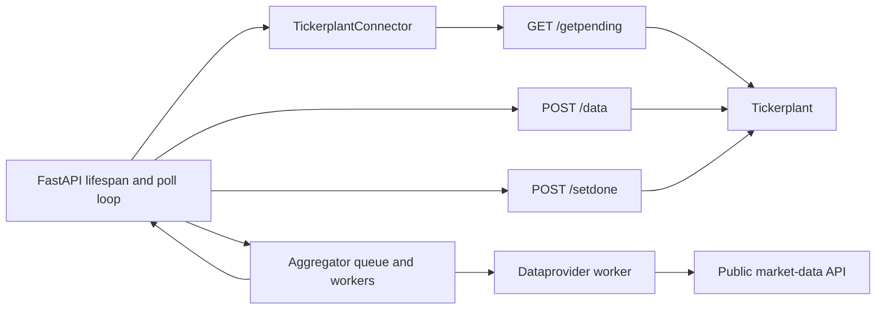

# Dataprovider Architecture

## Purpose

`dataprovider` is a background fill service. It polls the tickerplant for
pending symbol/month intervals, retrieves minute-level OHLCV data from the
configured public market-data API, and writes the normalized records back to
the tickerplant. The tickerplant is the source of truth for cached data and
metadata coverage.

The service does not currently expose a user-facing data request endpoint. Its
FastAPI application starts and stops the background polling task during the
application lifespan.

## Runtime Architecture



## Components

### `src/dataprovider/app.py`

The application owns service lifecycle and tickerplant orchestration:

- loads `/etc/dataprovider/config.yaml` at startup;
- creates the tickerplant connector and the `Aggregator`;
- polls pending work on a fixed 60-second loop;
- requests pending symbol/month rows through
  `TickerplantConnector.getpending(start, end)`;
- processes each pending month and pushes its records before marking it done;
- cancels the polling task during FastAPI shutdown.

The application should not construct tickerplant HTTP requests directly. The
current implementation must also provide `tickerplant.url` and `symbols` in
the loaded configuration before polling can run.

### `src/dataprovider/aggregator.py`

`Aggregator` owns provider query scheduling:

- validates `(symbol, start_date, end_date)` queries;
- uses the configured exchange calendar to split a month into provider-safe
  intervals;
- processes queued intervals in batches using `Dataprovider` workers;
- invokes its callback for successful payloads;
- requeues failed intervals;
- waits 60 seconds after a detected HTTP 429 response before retrying that
  interval.

The singleton design shares one queue and worker state within the process.
`max_query_size` defaults to 5,000. The splitter reserves two points, so a
normal one-minute chunk targets at most 4,998 trading minutes; this leaves room
for provider boundary behavior. The provider response is represented as a
dictionary keyed by its datetime values, so duplicate keys within a response
are naturally overwritten. Cross-window deduplication is not performed by the
aggregator.

### `src/dataprovider/dataprovider.py`

`Dataprovider` owns public API access:

- decodes the base64 API key from configuration;
- builds `time_series` requests with symbol, interval, and date bounds;
- fetches asynchronously with `aiohttp`;
- requests up to 5,000 output points;
- converts the response `values` list into a dictionary keyed by datetime;
- exposes successful data, response errors, and the HTTP status separately.

API keys are excluded from request logs. Timeouts, non-200 responses, and
unexpected provider failures are retained as worker errors so the aggregator
can requeue the interval.

## Connector Contract

The connector package is at
`packages/connector/src/connector/connector.py`. It is the only dataprovider
boundary for tickerplant communication. Its current methods are:

- `getpending(start, end)` calls `GET /getpending` and returns pending rows
  containing `symbol`, `year`, and `month`;
- `meta(symbol, start, end)` calls `GET /meta` for symbol-specific pending
  metadata and is not part of the background fill loop;
- `data({symbol: records})` calls `POST /data` and expects a successful 204;
- `setdone(symbol, year, month)` calls `POST /setdone` after data insertion;
- `getdata(start, end, symbols)` calls `POST /getdata` for cached records and
  is available for consumers but is not used by the fill loop.

The app, aggregator, and provider must call connector methods rather than
constructing HTTP requests or depending on endpoint paths. This keeps the
tickerplant transport replaceable without moving public API fetching or
provider scheduling into the connector.

## Polling and Fill Lifecycle

1. Startup loads configuration and creates the connector and aggregator.
2. The poll loop determines the configured start and end bounds.
3. The connector calls `getpending(start, end)` once for all configured
   symbols.
4. Each returned `{symbol, year, month}` row is converted to UTC month bounds.
5. The aggregator splits that month into exchange-calendar-aware API windows.
6. Dataprovider workers fetch each window from the public API, subject to the
   configured batch size and provider rate limits.
7. Provider payloads are normalized to tickerplant records with these fields:
   `date`, `open`, `high`, `low`, `close`, and integer `volume`.
8. The app calls `connector.data({symbol: records})`.
9. Only after the data push succeeds does it call
   `connector.setdone(symbol, year, month)`.
10. Failed provider work remains pending and is retried. A failed data push
    must prevent the corresponding month from being marked complete.

The tickerplant treats timestamps without an offset as UTC when normalizing
incoming records. The dataprovider should preserve a consistent UTC
interpretation for month boundaries and provider timestamps.

## Configuration

The runtime configuration is YAML. The service expects top-level polling and
tickerplant settings plus nested provider settings:

```yaml
tickerplant:
  url: http://localhost:8000
symbols:
  - AAPL
start: 2024-01-01T00:00:00Z
end: 2024-12-31T23:59:59Z
dataprovider:
  batch_size: 8
  time_interval: 1
  max_query_size: 5000
  exchange_calendar: XNYS
  endpoint: https://api.twelvedata.com/time_series
  api_key_b64: <base64-encoded-api-key>
```

`exchange_calendar` defaults to `XNYS` in the aggregator. `batch_size`,
`time_interval`, and `max_query_size` also have defaults, but `endpoint` and
`api_key_b64` are required by the aggregator. API keys must remain in
configuration or environment data and must not be committed in plaintext.

## Error Handling and Rate Limits

- The provider records timeouts, HTTP errors, and unexpected failures instead
  of returning partial successful data.
- The aggregator requeues failed intervals. HTTP 429 responses trigger a
  60-second delay before retrying.
- The polling loop continues after an iteration-level failure and waits for
  the next poll interval.
- Data insertion must complete before metadata is marked done.
- Repeated fills must be compatible with the tickerplant's storage behavior;
  the current SQLite insert path does not define an upsert or unique
  `(symbol, date)` constraint, so duplicate handling must be resolved before
  claiming retries are idempotent.

## Implementation Notes

The architecture described here follows the current Python, HTTP, and SQLite
services. `GET /meta` remains a supported connector operation for
symbol-specific consumers, while the dataprovider's background service uses
`GET /getpending` to discover work across configured symbols. Any future
transport or database replacement should preserve the connector method
contracts and the polling lifecycle above.
